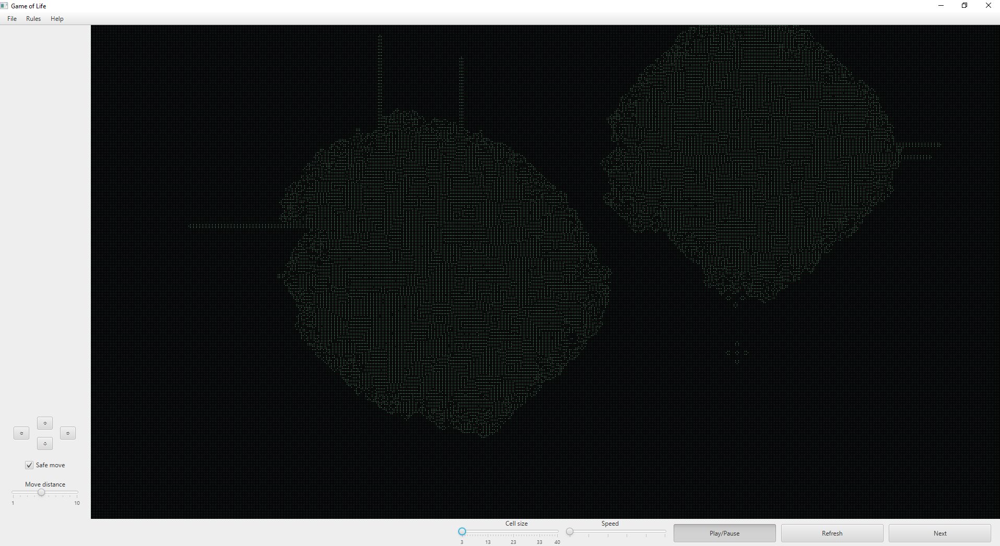

# Game of Life
## Om prosjektet
I forbindelse med faget ITPE1600 - Programutvikling, fikk vi som oppgave å lage [Conway's Game of Life](https://en.wikipedia.org/wiki/Conway%27s_Game_of_Life).

<br>

## Hvordan kjøre spillet
- Det kreves **JDK 8+**

**Windows**
```cmd
> gradlew run
```

**Linux/macOS**
```bash
> ./gradlew run
```
<br>

## Screenshots



